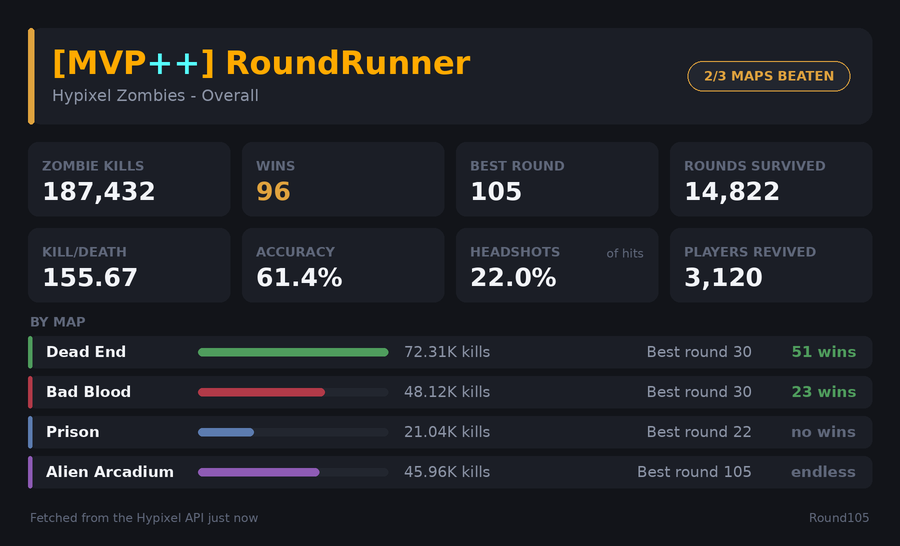
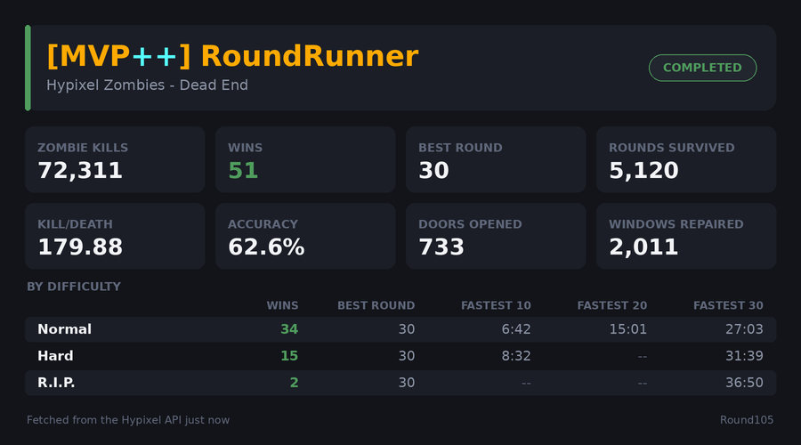
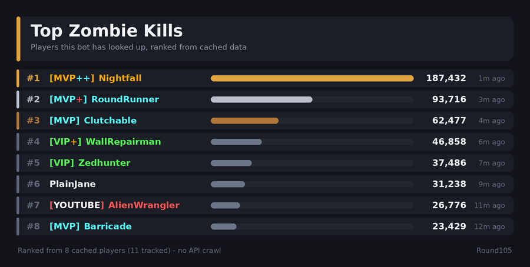

# Round105

A Discord bot that looks up **Hypixel Zombies** statistics by Minecraft username and
renders them as image cards.

Ask it for a player and it resolves the username to a UUID, pulls their Hypixel
player data, pulls the Zombies counters out of it, and replies with a rendered
card rather than a wall of text.



## Commands

Every command works as a slash command and, if you enable the message content
intent, with a text prefix (`z!` by default).

| Command | Aliases | Shows |
| --- | --- | --- |
| `/stats <username>` | | Overall totals, plus a per-map summary bar |
| `/deadend <username>` | `de` | Dead End, broken down by difficulty |
| `/badblood <username>` | `bb` | Bad Blood, broken down by difficulty |
| `/prison <username>` | | Prison, broken down by difficulty |
| `/alienarcadium <username>` | `aa` | Alien Arcadium, with progress toward round 105 |
| `/kills <username>` | | Combat detail: K/D, accuracy, headshots, kills per map |
| `/rankings [stat]` | `lb`, `top` | Ranks the players this bot has already cached |

Map cards list wins, best round, and fastest 10/20/30-round clears per
difficulty. Alien Arcadium has no difficulty selector and no win condition, so
its card shows round progress instead.



`/rankings` accepts `kills`, `wins`, `best_round`, `rounds`, `kdr`, `accuracy`,
`revives`, `doors`, or `windows`.



## Setup

Requires Python 3.11 or newer.

```bash
git clone <your-fork-url>
cd round105
python -m venv .venv
source .venv/bin/activate      # Windows: .venv\Scripts\activate
pip install -r requirements.txt
cp .env.example .env
```

Then fill in `.env`:

1. **Discord token.** Create an application at
   [discord.com/developers/applications](https://discord.com/developers/applications),
   add a bot, and copy its token into `DISCORD_TOKEN`.
2. **Hypixel API key.** Request one at
   [developer.hypixel.net](https://developer.hypixel.net) and put it in
   `HYPIXEL_API_KEY`.
3. **Invite the bot.** On the application's OAuth2 page, generate a URL with the
   `bot` and `applications.commands` scopes, and the "Send Messages" and "Attach
   Files" permissions.

Then start it:

```bash
python -m round105
```

Slash commands are registered on startup. A global registration can take up to
an hour to appear in clients, so while developing set `DEV_GUILD_ID` to your
test server's ID; guild-scoped commands show up immediately.

### Configuration

Everything is read from the environment (or `.env`). Only the first two are
required.

| Variable | Default | Purpose |
| --- | --- | --- |
| `DISCORD_TOKEN` | | Bot token |
| `HYPIXEL_API_KEY` | | Hypixel API key |
| `COMMAND_PREFIX` | `z!` | Prefix for text commands |
| `ENABLE_PREFIX_COMMANDS` | `false` | Request the privileged message content intent |
| `DEV_GUILD_ID` | | Register slash commands to one guild instead of globally |
| `CACHE_TTL_SECONDS` | `300` | How long a cached player stays fresh |
| `NAME_TTL_SECONDS` | `86400` | How long a username to UUID mapping is reused |
| `CACHE_PATH` | `data/cache.sqlite3` | Where the cache lives |
| `LEADERBOARD_SIZE` | `10` | Rows shown by `/rankings` |
| `REQUEST_TIMEOUT_SECONDS` | `10` | Timeout for Mojang and Hypixel requests |
| `FONT_REGULAR`, `FONT_BOLD` | auto-detected | Override the card fonts |

Cards need a TrueType font. The bot looks for DejaVu, Liberation, or Arial in the
usual locations on Linux, macOS, and Windows, and falls back to a font bundled
with Pillow if it finds none. Set `FONT_REGULAR` and `FONT_BOLD` to use
something specific.

## How it works

Hypixel issues a fixed request budget per API key per five-minute window, so
the bot is built to spend as few requests as it can.

**Player data is cached for five minutes per UUID.** Lookups are answered from a
local SQLite file until the entry expires. Only the Zombies counters and the few
fields needed to draw a name plate are stored, which keeps a cached player in
the low kilobytes rather than the megabyte a full Hypixel player object can
reach.

**Concurrent lookups of the same player collapse into one request.** If five
people run `/stats` on the same name at once, four of them wait on the first
request rather than each spending budget.

**The rate limiter reads Hypixel's own headers.** Every response reports the
remaining budget and when the window resets. The client tracks both and waits
locally for the reset instead of earning a `429`, which carries a longer
penalty. A small slice of the budget is deliberately left unspent as headroom.

**Expired data is a fallback, not garbage.** Cache rows are never deleted on
read. If Hypixel times out or rate limits the bot, it serves the stale row and
says so on the card and in the message, instead of failing. The same applies to
Mojang: if username resolution is unavailable, a previously seen
username-to-UUID mapping is reused, since those effectively never change owner.

**Leaderboards never crawl the API.** `/rankings` ranks only players already in
the local cache, sorted in-process. That makes it free to run, but it is a
ranking of *players this bot has been asked about*, not of Hypixel as a whole —
a player appears only once someone has looked them up. The card states this, and
shows how stale each row is.

**Stat parsing is deliberately forgiving.** Zombies counters live in a flat dict
at `player.stats.Arcade`, where the key encodes the scope:

| Key | Scope |
| --- | --- |
| `zombies_zombie_kills` | All maps |
| `zombies_zombie_kills_deadend` | One map |
| `zombies_best_round_deadend_hard` | One map, one difficulty |
| `zombies_fastest_time_30_deadend_normal` | Seconds to clear 30 rounds |

Hypixel omits any counter a player has never incremented and has renamed
counters over the years, so every read treats a missing or non-numeric value as
zero. A card still renders when the API's shape drifts.

## Project layout

```
round105/
  __main__.py      Entry point: logging, config, startup errors
  bot.py           Wires config, HTTP session, clients, cache, and cogs
  config.py        Environment configuration and validation
  mojang.py        Username -> UUID resolution
  hypixel.py       Hypixel API client and rate limiter
  store.py         SQLite cache, and the source for leaderboards
  service.py       Caching, fallback, and request-coalescing policy
  zombies.py       Zombies stat model and key parsing
  ranks.py         Hypixel rank resolution and Minecraft colours
  formatting.py    Number, duration, and age formatting
  rendering/       Card layouts, theme, and drawing surface
  cogs/zombies.py  The Discord commands
```

Command handlers talk only to `StatsService`, so when to hit the network, when
to answer from cache, and what to do during an outage are all decided in one
place — and can be tested without a Discord connection.

## Development

```bash
pip install -r requirements-dev.txt
python -m pytest
```

The suite covers stat parsing against a checked-in player fixture, rank
resolution, the cache's TTL and fallback behaviour, the service's caching policy
and outage handling, both API clients' error mapping (via a fake HTTP session),
card rendering, and the commands themselves with a fake Discord context. No test
touches the network.

To see the cards after a layout change:

```bash
python scripts/preview_cards.py preview
```

That renders every card — including the empty and stale states — from the test
fixture into `preview/`, so it needs no API key.

## Notes

Not affiliated with Hypixel or Mojang. Hypixel's API terms apply to whatever you
do with the data it returns.
